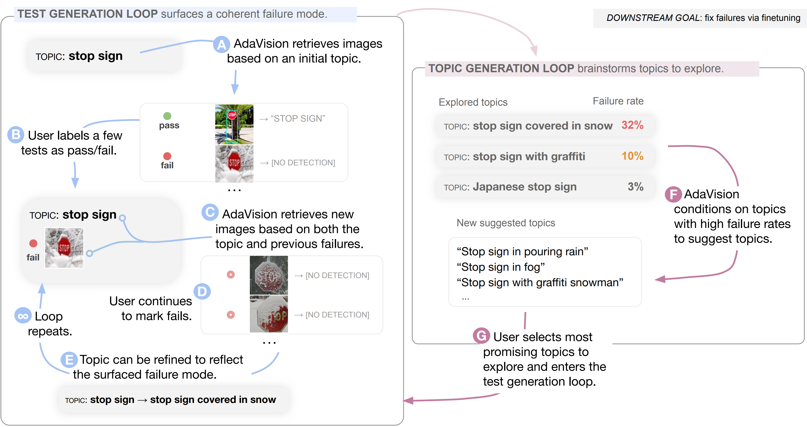

# AdaVision
AdaVision is a human-in-the-loop tool for testing computer vision models! 

Given a natural language description of a group of images to test (*e.g.* red stop signs), AdaVision retrieves relevant images from LAION-5B.
The user then labels a small amount of data for model correctness (pass/fail), which is used in successive retrieval rounds to hill-climb towards high-error regions.
AdaVision also uses GPT-3 to suggest new group descriptions for users to explore.

* Retrieved images are called **tests**. AdaVision automatically feeds these through your vision model and displays the model output. Tests can be labeled as *passed*, *failed*, or *off-topic.*
* Tests are organized inside folders called **topics,** which should represent coherent groups of images. When topics have particularly high failure rates, we call them **bugs.**

After testing a model with AdaVision, users accumulate a collection of topics with tests inside, which is called a **tree.** Finetuning on tests within a tree can help fix bugs, leading to an iterative debugging process similar to traditional software development. See paper for details.


<p align="center">
  <br/>
</p>

<small>*AdaVision is forked from [AdaTest for NLP](https://github.com/microsoft/adatest).*</small>

## Installation

Clone this repository, and then run

```
pip install -r requirements.txt
```

In addition to providing the testing tool (`adatest/`) and frontend (`client/`), this repository also includes a suite of vision models one can test and wrapper classes to connect them to the testing tool (`vision_models/`). 
To install dependencies needed for these models / wrapper classes, see `vision_models/README.md`.

## Running AdaVision
An example script to test a ResNet50 is given in `test_resnet.py`.

### Connecting custom models to AdaVision
To test a model, wrap it in a `Scorer`, and then pass it to the `adapt()` function of an `adatest.TestTree`. For example:
```python
# set up a new testing session, and specify which file the tree will be written to
tests = adatest.TestTree("test_trees/local/my-first-tree.csv")

# load a model and wrap it in a Scorer
model = vision_models.load.load_torchvision_model("resnet50")
scorer = adatest.ClassifierScorer(model)

# serve to the browser 
adatest.serve(tests.adapt(
    scorer
))
```

AdaVision can currently test classification, object detection, and image captioning models. Models of each kind should be wrapped in the appropriate scorer (`ClassifierScorer`, `DetectionScorer`, or `CaptioningScorer`). 

All models should **take in a list of image urls** as input. Depending on the task, the scorers expect models to output certain forms:

* **Classification.** The model should output an $n \times |\mathcal Y|$ matrix giving the probabilities of each class. Models should also have an attribute called **output_names** listing class names. Wrap the model in a `ClassifierScorer` to test. Alternatively, use the `vision_models.model.ClassificationModel` class to wrap your model and conform it to this output format.

```python
# load the raw model and a list of classnames
model_raw = torchvision.models.resnet50()
with open('path/to/classnames.txt', 'r') as f:
  list_of_imagenet_classes = f.readlines()

# wrap in vision_models.model.ClassificationModel
model = vision_models.model.ClassificationModel(
  model_raw, 
  output_names=list_of_imagenet_classes,
  transform_list=[torchvision.transforms.CenterCrop(224), torchvision.transforms.toTensor()],
  batch_size=24,
)

# use by wrapping in scorer 
scorer = adatest.ClassifierScorer(model, top_k=3) # display the top 3 predictions
```
* **Detection.** The model should output three lists: an $n$-list of lists of (xmin, ymin, xmax, ymax) bounding boxes, an $n$-list of lists of labels for each box, and an $n$-list of lists of confidences for each box. Each inner list can have arbitrary length. Models should also have an attribute called **output_names** listing class names. Wrap the model in a `DetectionScorer` to test. Alternatively, use the `vision_models.model.DetectionModel` class to wrap your model and conform it to this output format.
```python
# load the raw model and a list of classnames
model_raw = torchvision.models.detection.fasterrcnn_resnet50_fpn()
with open('path/to/classnames.txt', 'r') as f:
  list_of_coco_classes = f.readlines()

# wrap in vision_models.model.DetectionModel
model = vision_models.model.DetectionModel(
  model_raw, 
  output_names=list_of_coco_classes,
  transform_list=[torchvision.transforms.Resize((224, 224)), torchvision.transforms.toTensor()],
  batch_size=24,
)

# use by wrapping in scorer 
scorer = adatest.DetectionScorer(model)
```

* **Captioning.** The model should output two lists: an $n$-list of lists of captions and an $n$-list of lists of confidences for each caption. Each inner list can have arbitrary length; AdaVision can be set to display the top k most confident captions. Wrap the model in a `CaptioningScorer` to test. Alternatively, use the `vision_models.model.CaptioningModel` class to wrap your model and conform it to this output format.
```python
# load the raw model
from vision_models.ofa import OFACaptioner
model_raw = OFACaptioner()

# wrap in vision_models.model.CaptioningModel
model = vision_models.model.CaptioningModel(
  model_raw, 
  transform_list=[torchvision.transforms.Resize((224, 224)), torchvision.transforms.toTensor()],
  batch_size=24,
)

# use by wrapping in scorer 
scorer = adatest.CaptioningScorer(model)
```

We provide easy access to a large library of pretrained models (already wrapped in `ClassificationModel`, `DetectionModel`, or `CaptioningModel`) in `vision_models.load`:
```python
model = vision_models.load.load_torchvision_model("resnet50") # classification example
model = vision_models.load.load_mmdet_model('yolox_x_8x8_300e_coco', min_confidence=0.85, batch_size=48) # detection example
```

### Generators
To test a target model (*e.g.* a ResNet), AdaVision uses two other large models to generate image tests and suggest challenging topic strings. These two other models are called **generators.**

* By default, tests are retrieved from [LAION-5B](https://laion.ai/blog/laion-5b/) by `adatest.generators.CLIPRetriever`, which is built on top of [the clip-retrieval package](https://github.com/rom1504/clip-retrieval/). 

* In our [paper](), we generate topics using GPT-3, prompted with a set of prompt templates (in `prompts.txt`). This generator is called `adatest.generators.PromptedTopicGenerator`.

Example usage:
```python
# test generator: CLIP
test_generator = adatest.generators.CLIPRetriever(
  aesthetic_weight=0.3,
  use_safety_model=True
)

# topic generator: GPT
with open('prompts.txt') as f:
    prompts = f.readlines()
    prompts = [t.strip() for t in prompts]

topic_generator = adatest.generators.PromptedTopicGenerator(
    values=model.output_names, 
    prompts=prompts, 
    text_completion_generator=adatest.generators.OpenAI(model="text-davinci-002", temperature=0.8, top_p=1, filter=None)
)

# name the two generators and pass in as a dictionary
generators = {
  'tests': test_generator,
  'topics': topic_generator,
}

# pass generator into adatest
adatest.serve(tests.adapt(
    scorer, generator=generators
))
```


### Testing process
After running `adatest.serve()`, AdaVision will pull up a web interface (defaults to localhost:8080). 

*Walkthrough to come!*

## Citation

If you find AdaVision useful, please cite our paper:
[Adaptive Testing of Computer Vision Models]().

<!-- ## Contributing

This project welcomes contributions and suggestions.  Most contributions require you to agree to a
Contributor License Agreement (CLA) declaring that you have the right to, and actually do, grant us
the rights to use your contribution. For details, visit https://cla.opensource.microsoft.com.

When you submit a pull request, a CLA bot will automatically determine whether you need to provide
a CLA and decorate the PR appropriately (e.g., status check, comment). Simply follow the instructions
provided by the bot. You will only need to do this once across all repos using our CLA.

This project has adopted the [Microsoft Open Source Code of Conduct](https://opensource.microsoft.com/codeofconduct/).
For more information see the [Code of Conduct FAQ](https://opensource.microsoft.com/codeofconduct/faq/) or
contact [opencode@microsoft.com](mailto:opencode@microsoft.com) with any additional questions or comments. -->

## Trademarks

This project may contain trademarks or logos for projects, products, or services. Authorized use of Microsoft 
trademarks or logos is subject to and must follow 
[Microsoft's Trademark & Brand Guidelines](https://www.microsoft.com/en-us/legal/intellectualproperty/trademarks/usage/general).
Use of Microsoft trademarks or logos in modified versions of this project must not cause confusion or imply Microsoft sponsorship.
Any use of third-party trademarks or logos are subject to those third-party's policies.
